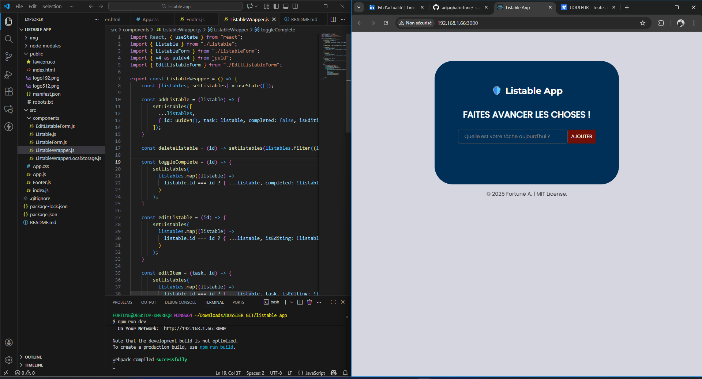
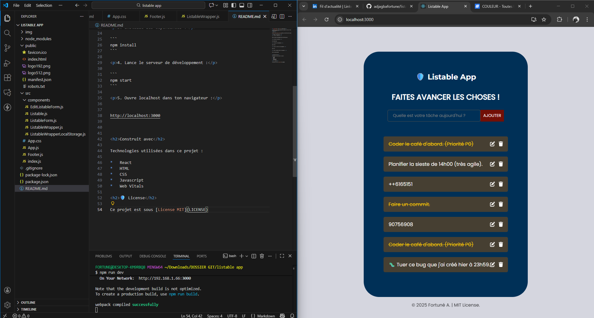

<h1 align="center" id="title">Listable App</h1>

<p id="description">Première version d'une application simple de liste de tâches utilisant React.js.</p>

 <br>
 <br>

<h2>Demo</h2>

[https://fortune-listable-app](https://adjagbafortune.github.io/listable-app/)

<h2>Étapes d'installation :</h2>

<p>1. Clone le repository :</p>

```
https://github.com/adjagbafortune/listable-app.git
```

<p>2. Accède au répertoire :</p>

```
cd listable-app
```

<p>3. Installe les dépendances :</p>

```
npm install
```

<p>4. Lance le serveur de développement :</p>

```
npm run dev
```

<p>5. Ouvre localhost dans ton navigateur :</p>


http://localhost:3000

  
  
<h2>Construit avec</h2>

Technologies utilisées dans ce projet :

*   React
*   HTML
*   CSS
*   Javascript
*   Web Vitals

<h2>🛡️ License</h2>

Ce projet est sous [License MIT](LICENSE)
