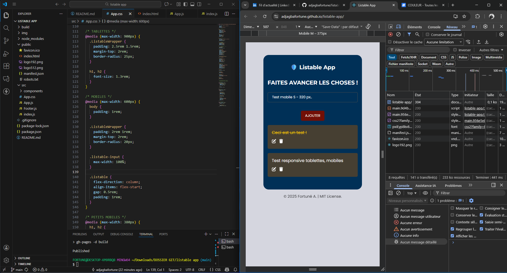

<h1 align="center" id="title">Listable App</h1>

<p id="description">Listable App (version 1.0), une application de gestion de tâches entièrement développé sous React.js. Ce projet intègre la persistance des données avec le Local Storage et illustre une approche simple, modulaire et évolutive de la gestion de tâches.</p>

 <br>
 <br>
 <br>

<h2>Demo</h2>

[https://fortune-listable-app](https://adjagbafortune.github.io/listable-app/)

<h2>Étapes d'installation :</h2>

<p>1. Clone le repository :</p>

```
https://github.com/adjagbafortune/listable-app.git
```

<p>2. Accède au répertoire :</p>

```
cd listable-app
```

<p>3. Installe les dépendances :</p>

```
npm install
```

<p>4. Lance le serveur de développement :</p>

```
npm run dev
```

<p>5. Ouvre localhost dans ton navigateur :</p>


http://localhost:3000

  
  
<h2>Construit avec</h2>

Technologies utilisées dans ce projet :

*   React
*   HTML
*   CSS
*   Javascript
*   Web Vitals

<h2>🛡️ License</h2>

Ce projet est sous [License MIT](LICENSE)
